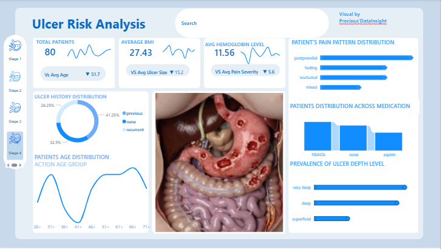

# Ulcer-Risk-Analysis-Dashboard
A healthcare analytical Power BI dashboard designed to analyse ulcer risk patterns, patient demographics, medication usage, pain distribution, ulcer depth prevalence, BMI trends and hemoglobin levells.

The Ulcer Risk Analysis Dashboard is an interactive healthcare analytics solution developed using Ms Power BI. The dashboard provides insights into ulcer risk factors, patients demographics, medication patterns, pain distribution, ulcer history and ulcer depth prevalence.
The aim of this project is to support healthcare professionals and researchers in understanding ulcer-related trends and making data driven decisions.

Dashboard Features.
Total patients analysis.
Average BMI tracking.
Hemoglobin level monitoring.
Patients pain pattern distribution.
Ulcer history distribution.
Medication usage analys.is
Ulcer depth prevalence.
Age distribution analysis.
Interactive filtering and navigation.

Tools used.
Ms Power .BI
Ms Excel.
Power BI power Query.
Data cleaning and Transformation.
Data visualization.

Healthcare Questions Answered
which age group is most affected by ulcer?
what pain patterns are most common among patients?
how does medication usage relate to ulcer prevalence?
what proportion of patients have recurrent ulcer history?
which ulcer depth level is most prevalent?
how do BMI and hemoglobin levels vary across patients?

Insights Generated

Postprandial pain appears more common among patients.
Deep and very deep ulcer levels shows higher prevalence.
NSAID usage may contribute significantly to ulcer occurence.
Certain age group demonstrated higher ulcer risk trends.

